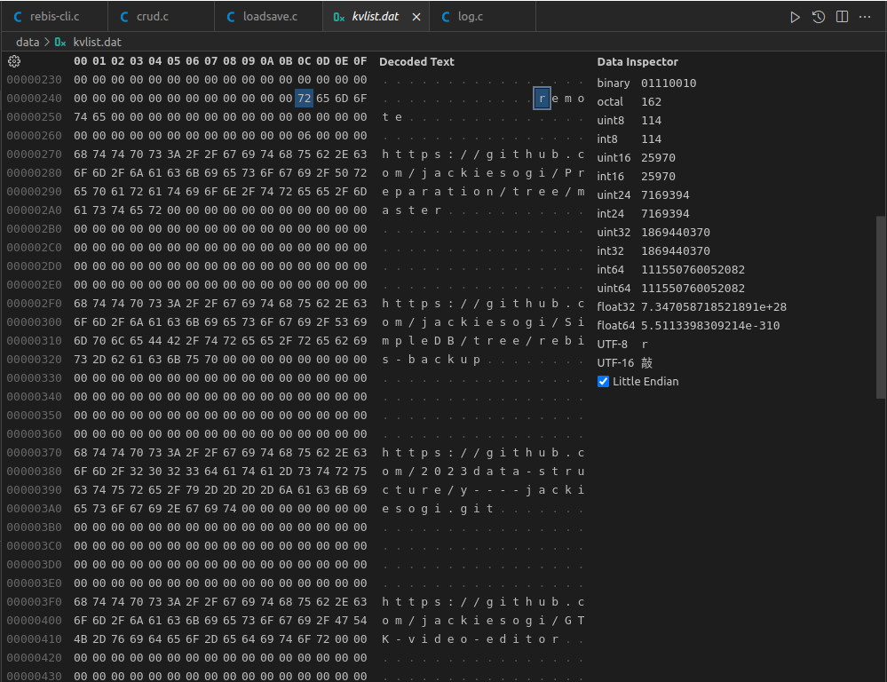

## Linked List使用的資料結構
- 宣告在[datastructure.h](./include/datastructure.h?plain=1#L36)
```c
#define MAX_ENTRIES 1000
// 雙向鏈結串列的Node
struct Node
{
	char value[128];
	struct Node *next;
	struct Node *prev;
};

// 紀錄雙向鏈結串列的資訊
struct Node_List
{
	char name[32];      // 此list的名字
	int length;         // 此list目前有幾個Node
	struct Node *head;  // 指向第一個Node的指標
	struct Node *tail;  // 指向最後一個Node的指標
};

// 一個包含檔案（儲存多個List）、檔案標示符
struct List_Connection
{
	const char* filename;                   // 儲存數個Node_List的檔案
	int fd;                                 // 檔案標示符
	int count_entries;                      // 目前有幾個Node_List
	struct Node_List list [MAX_ENTRIES];    // Node_List的陣列
};
```

## 檔案存取Linked Lists
- 不同於作業二，可以直接將整個`KeyValue_Table`寫入檔案中；這次的資料結構屬於動態配置，不適合直接將指標的內容（記憶體位址）寫入檔案，因為那些位址在程式結束後就還給作業系統了；所以，只應該儲存Linked List上的內容。
- 在程式結束前，必須先Serialization，將一些重要資訊寫入檔案，讓下次載入程式時可以重建一模一樣的Linked List。詳細可見[loadsave.c](./src/loadsave.c)的`load_list_from_file()`和`save_list_to_file()`，以下僅簡述作法：

### 儲存
- 詳細可見[loadsave.c:173](./src/loadsave.c?plain=1#L173)，`save_list_to_file()`
```c
void save_list_to_file(const struct List_Connection *connection);
```

1. 由於想要紀錄整個`List_Connection`，先寫入變數`count_entries`，這決定了下次程式載入時要連續從檔案中讀取幾個Node_List。
```c
write(connection->fd, &connection->count_entries, sizeof(int))	// loadsave.c:181
```
2. 寫入`Node_List`的`name`和`length`（長度取決了載入時要連續讀幾個`Node`）
```c
// 寫入list的名稱 (32 Bytes)	loadsave.c:194
write(connection->fd, &(connection->list[i].name), sizeof(connection->list[i].name));
// 寫入list的長度(4 Bytes)	loadsave.c:196
write(connection->fd, &(connection->list[i].length), sizeof(connection->list[i].length));
```
3. 寫入每個`Node`的`value`
```c
// 從head開始單向尋訪整個list	loadsave.c:198
for (struct Node *current = list->head; current != NULL; current = current->next)
{
    if (write(connection->fd, current->value, sizeof(current->value)) == -1)
    {
        perror("write value");
        close(connection->fd);
        exit(1);
    }
    elements_written++;
}
```
4. 例如一個叫做remote的list儲存的結果會像是以下圖片



### 讀取 並 重建Linked List
- 詳細可見[loadsave.c:224](./src/loadsave.c?plain=1#L224)，`load_list_from_file()`
1. 先建一個一樣的`List_Connection`結構
```c
// loadsave.c:232
struct List_Connection *newConnection = (struct List_Connection *)malloc(sizeof(struct List_Connection));
    newConnection->filename = filename;
    newConnection->fd = fd;
    newConnection->count_entries = 0; // Initialize count_entries
}
```
2. 讀完`count_entries`後開始跑`count_entries`個迴圈
```c
read(fd, &newConnection->count_entries, sizeof(int))	// loadsave.c:263

for (int i = 0; i < newConnection->count_entries; i++)	// loadsave.c:271
{
	// 讀取每個List的資訊
}
```

## Linked List操作
|指令|傳送門|
|-|-|
|`LPUSH`|[crud.c:149](./src/crud.c?plain=1#L149)|
|`LPOP`|[crud.c:188](./src/crud.c?plain=1#L188)|
|`RPUSH`|[crud.c:237](./src/crud.c?plain=1#L237)|
|`RPOP`|[crud.c:276](./src/crud.c?plain=1#L276)|
|`LLEN`|[crud.c:326](./src/crud.c?plain=1#L326)|
|`LRANGE`|[crud.c:376](./src/crud.c?plain=1#L376)|
- 關於`QueryObject`的用途，可見[HW2說明文件.md:51](./HW2說明文件.md?plain=1#L51)說明
- 以下以接收`LPUSH`指令的`list_lpush()`做說明
1. 函式原型
```c
struct QueryObject* list_lpush(struct List_Connection *lconnection, const char *listname, const char *value)
```
|參數|解釋|
|-|-|
|`lconnection`| 要push到哪個`List_Connection`下面的list（目前整個程式在run時只會有一個`List_Connection`）|
|`listname`| 要push到哪個list|
|`value`| 要push的value|

- 回傳值回傳一個`QueryObject`顯示push之後的各種資訊
- 對應到指令的話會是
```sh
LPUSH "listname" "value"
```

1. code解說
```c
int index = get_list_index(lconnection, listname);	// 要查找的listname 在lconnection下list陣列的第幾個index？

struct QueryObject *qobj = (struct QueryObject*)malloc(sizeof(struct QueryObject));	// 建立一個新的QueryObject，用於回傳query後的資訊

// 要填入QueryObject的其中兩樣資訊
//     - query_string : 當初使用者下的指令
//     - msg          : query之後的訊息（打完指令會顯示在terminal上的訊息）
char query_string[168], msg[200];

sprintf(query_string, "LPUSH %s %s", lconnection->list[index].name, value);	// print "LPUSH %s %s" 這個字串到 query_string

if (index == -1)	// get_list_index()如果回傳-1代表當前的lconnection內沒有這個listname
{
    index = create_list(lconnection, listname);
}

struct Node *newnode = (struct Node*)calloc(1, sizeof(struct Node));
strncpy(newnode->value, value, 128);

if (lconnection->list[index].head == NULL)
{
    // 目前這個list是空的
    lconnection->list[index].head = newnode;
    lconnection->list[index].tail = newnode;
}
else
{
    // 目前這個list不是空的
    newnode->next = lconnection->list[index].head;
    lconnection->list[index].head->prev = newnode;
    lconnection->list[index].head = newnode;
}
// 成功push的話 在這個index的list又新增了一個新的元素
lconnection->list[index].length++;

sprintf(msg, "left push \"%s\" into list \"%s\"", value, lconnection->list[index].name);
set_query_info(qobj, query_string, 15, "N/A", value, msg);	// set_query_info()用於將資訊填入特定`QueryObject`實體

return qobj;
```