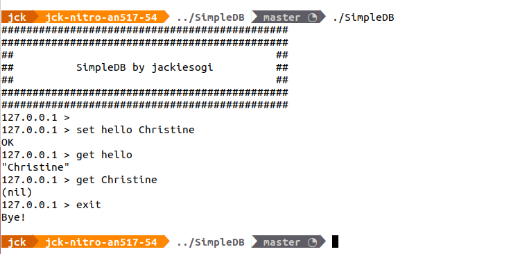

# Rebis DB


## Features
* Command line interface.
* Key-Value storage.
* Light weight.

### Features under development
* Remote access.
* Encryption on stored data.

## Build by yourself
* Navigate to the directory you want to build, and open in terminal:
```sh
git clone https://github.com/jackiesogi/SimpleDB/tree/rebis-backup
cd SimpleDB/
make
```
* By default, the SimpleDB directory will not add to your environment variable, you can add it if needed.

## Commands
* Start the rebis-cli
```sh
./rebis-cli
```

* Set key and value
```sh
set example_key_1 Helloworld
```

* Get value by key
```sh
get example_key_1
```

*  Delete value and key
```sh
del example_key_1
```