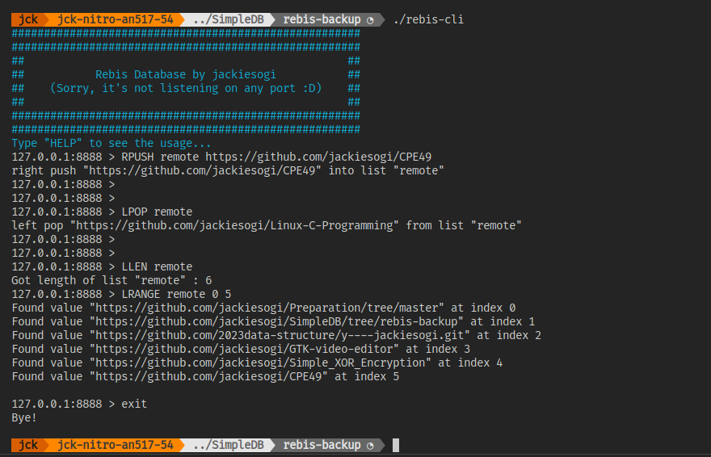

# Rebis DB

## Features
* Command line interface.
* Key-Value storage.
* Light weight.

### Features under development
* Remote access.
* Encryption on stored data.

## Build by yourself
* Navigate to the directory you want to build, and open in terminal:
```sh
git clone https://github.com/jackiesogi/SimpleDB/tree/rebis-backup
cd SimpleDB/
make
```
* By default, the SimpleDB directory will not add to your environment variable, you can add it if needed.

## All Supported Commands
```sh
FLUSHDB                   # Clear all data.
SET <key> <value>         # Set key and value.
GET <key>                 # Get value by key.
DEL <key>                 # Delete value by key.
HELP                      # Show help page.
EXIT                      # Exit the program.
LPUSH <list> <value>      # Left push value to the list .
RPUSH <list> <value>      # Right push value to the list.
LPOP  <list>              # Left pop value from the list.
RPOP  <list>              # Right pop value from the list.
LLEN  <list>              # Get the length of the list.
LRANGE <index1> <index2>  # Get the value within the index range.
```

## Example
* Start the rebis-cli
```sh
./rebis-cli
```

* Set key and value
```sh
SET example_key_1 Helloworld
```

* Get value by key
```sh
GET example_key_1
```

*  Delete value and key
```sh
DEL example_key_1
```