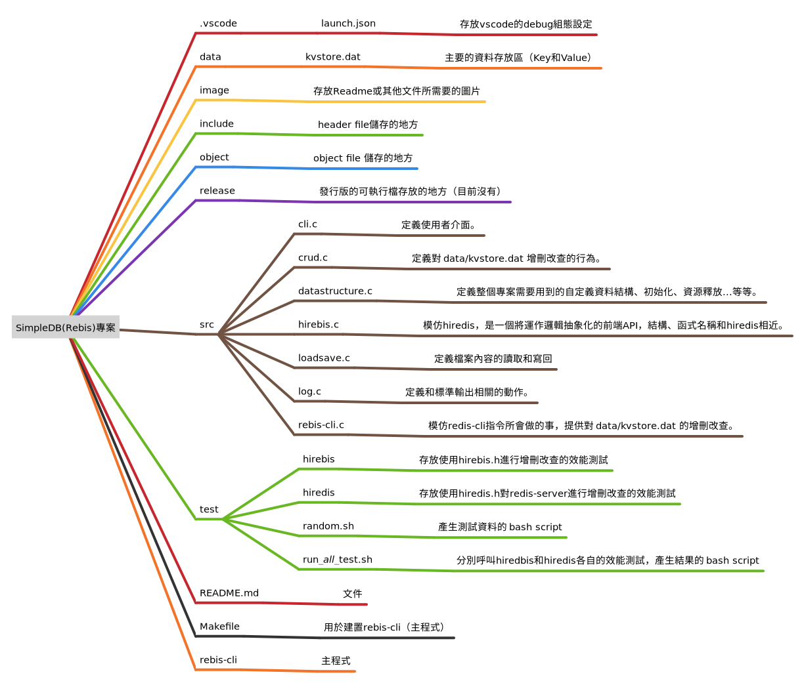
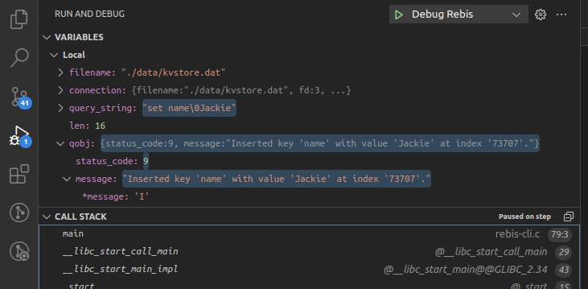
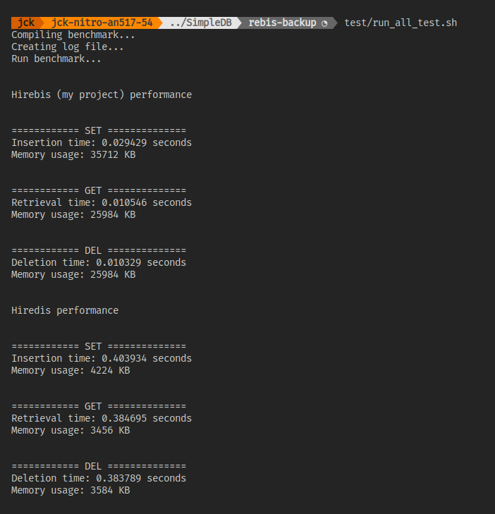

# 說明文件

### 專案架構
- 整個專案皆使用相對路徑，若需要`#include`時請注意檔案位置
- 每個`include`路徑下的header file皆有一個同名的原始碼，存放在`src`路徑下



### Key Value 使用的資料結構
- 資料結構的採用和作業一類似，唯獨 `KeyValue` 結構新增了一個 `KeyValue *next`指標，用來實作 Seperate chaining ，以處理 hash table 中 collision 的問題

```C
/* 宣告於 include/datastructure.h 內 */

# define MAX_ENTRIES 100000
struct KeyValue
{
	char key[32];
	char value[128];
	struct KeyValue *next;
};

struct KeyValue_Table
{
	int32_t count_entries;
	int32_t max_size;
	struct KeyValue records[MAX_ENTRIES];
};
```

### 其他資料結構
* 詳細可見[datastructure.h](./include/datastructure.h) 和 [hirebis.h](./include/hirebis.h)
##### Connection
```C
struct Connection
{
	const char* filename;
	int fd;
	struct KeyValue_Table* table;	
};
```
`Connection`這個結構定義了...
- `filename`，存放key value這些內容的檔案路徑
- `fd`，檔案標示符，呼叫POSIX C `open()`所得到的 descriptor
- `table`，一個 `KeyValue_Table`結構的儲存體，儲存了從`filename`讀取進來的資料

值得一提的是...
- 每當程式開始，需要連結到一個存放key和value的檔案時，都需要先建立`Connection`物件，可以見[rebis-cli.c](./src/rebis-cli.c)第54行
- `Connection`物件可以藉由呼叫[`load_data_from_file()`](./include/loadsave.h)來取得（定義在`src/loadsave.c`）

##### QueryObject
```C
struct QueryObject
{
	const char *query_string;
	int status_code;
	const char *key;
	const char *val;
	const char *message;
};
```
`QueryObject`這個結構定義了...
- `query_string`
  1. 使用者在執行rebls-cli時所輸入的指令
  2. 使用者使用 `type_command()` （定義在[crud.c](./src/crud.c)）這個函式所放入的參數，`type_command()`目前是個太容長的function，還有待改良。
- `status_code`，描述 CRUD 執行後的狀態
- `key`，執行 query 要尋找的 key
- `val`，執行 query 後找到的 value（如果沒找到會是 "nil"）
- `message`，描述 CRUD 執行完的結果（即是rebis-cli 執行指令後會得到的輸出）
- 下圖中的`qobj`，就是一個執行完`SET name Jackie`，所取得的`QueryObject`實體，


值得一提的是...
- 所有的 CRUD 函式所回傳的都是`QueryObject`型別（可見[crud.c](./src/crud.c)）

### hiredis.h


### 性能測試

##### 測試標的
1. hirebis.h（我的）
2. hiredis.h（他們的）

##### 前置準備：
- Linux 環境，有 shell 或 bash
- 裝好 hiredis 並且能夠正確呼叫
- clone 目前這個project

##### 測試進行：
```plain
預設測資都已經存放在正確的路徑，可視需求產生其他測資
```
1. 調整`test/random.sh`檔案內的參數，產生隨機的測資
2. 將測資放到`test/hirebis/test_data`路徑下
3. 在此專案的**根目錄**下，執行`test/run_all_test.sh`，此script會...
    - 編譯 `test/hirebis/benchmark-SET.c` ......
    - 執行和[benchmark相關的程式](./test/hirebis/benchmark-SET.c)，並將結果寫入`test/hirebis/test_log`或`test/hiredis/test_log`路徑下
    - 將結果顯示在terminal


##### benchmark 設計
- 每個benchmark測試不同的指令，但內容大同小異；在[benchmark-SET.c](./test/hirebis/benchmark-SET.c)中(測試hirebis.h的效能)，簡易的測試邏輯如下...
- 對於每一個benchmark測試（SET, GET, DEL），目前都是執行隨機4萬筆指令，可見[test_data_for_GET.txt](./test/hirebis/test_data/test_data_for_GET.txt)
```C
// 發送一個 FLUSHDB 的指令，先讓kvstore.dat檔案清空
rebisReply *initializtion = rebisCommand(connect, "FLUSHDB");

// 獲取起始時間
gettimeofday(&start, NULL);

for (int j = 0; j < 40000; j++)
{   
    rebisReply *reply = rebisCommand(connect, <測資內第j行SET指令>);
    free(reply);
}

// 獲取結束時間
gettimeofday(&end, NULL);

// 獲取記憶體用量
long memory_usage = usage.ru_maxrss;
```